# AGENTS.md — Argustack Development Guide

This file guides AI coding agents (Claude Code, GitHub Copilot, Cursor, etc.) working on this codebase.

## Build & Test

```bash
npm install                        # install dependencies
npm run dev -- sync                # run in dev mode (tsx)
npm run build                      # compile TypeScript

npm run ci                         # MUST PASS: typecheck + lint + all tests
npm run typecheck                  # TypeScript only
npm run lint                       # ESLint only

npm test                           # all test suites (unit + integration + MCP + architecture)
npm run test:unit                  # unit tests only
npm run test:integration           # integration tests (use fakes, no real DB)
npm run test:mcp                   # MCP server tests (InMemoryTransport)
npm run test:arch                  # architecture tests (SSOT validator, no-eslint-disable)
npm run test:watch                 # watch mode
```

## CLI Command Reference

```bash
# Hub lifecycle
argustack init                                # bootstrap the hub (one-time)
argustack migrate-to-hub                      # import legacy per-folder workspaces (idempotent)

# Workspaces
argustack workspace add <name>                # create a new workspace
argustack workspace list                      # list all workspaces in the hub
argustack workspace use <name>                # set active workspace (~/.argustack/active-workspace.json)
argustack workspace info [name]               # row counts per source (defaults to active)
argustack workspace remove <name>             # delete workspace + all data (CASCADE)

# Bind sources to a workspace
argustack add jira   --workspace X --url ... --email ... --token ...
argustack add git    --workspace X --path /path/to/repo
argustack add github --workspace X --owner ORG --repo REPO --token ...
argustack add csv    --workspace X --file /path/to/export.csv
argustack add db     --workspace X --engine postgres --host ... --port ... --user ... --password ... --database ...
argustack add code   --workspace X --root /path/to/repo
argustack source list --workspace X           # inspect what is bound

# Data movement
argustack sync                                # pull all bound sources for active workspace
argustack sync jira|git|github|csv|db         # pull a single source
argustack sync --since 2025-01-01             # incremental
argustack push                                # push local board tasks to Jira
argustack push --updates                      # push locally modified issues
argustack embed                               # OpenAI embeddings for issues (requires OPENAI_API_KEY)

# Knowledge graph (issues + commits + PRs)
argustack graph build                         # build from synced data
argustack graph stats                         # entity / relationship counts

# Code intelligence (Neo4j + Qdrant + Ollama)
argustack code index --project X              # incremental by hash (--full | --status | --lsp)
argustack code watch --project X              # real-time re-index on file save (--daemon)
argustack code list                           # registered code projects
argustack code stats --project X              # symbols, vectors, last job
argustack code status                         # health of Neo4j/Qdrant/Ollama
argustack code unregister --project X         # remove project + indexed data

# MCP integration
argustack mcp install                         # register Argustack with Claude Desktop / Claude Code
argustack mcp uninstall                       # remove the entry

# Misc
argustack status                              # hub overview
argustack board                               # start local Kanban UI for ./Docs/Tasks
```

> `argustack code init` is **deprecated** — `argustack init` now bootstraps the whole hub (Postgres + Neo4j + Qdrant + Ollama) in `~/.argustack/`.

### Non-interactive mode

For AI agents and CI/CD — `argustack init` runs unattended and binds sources via dedicated subcommands:

```bash
# Bootstrap the hub with a first workspace, skip the LLM prompt:
argustack init --no-interactive --name my-project --skip-llm

# Bind sources by flag (each subcommand has its own --help):
argustack add jira   --workspace my-project --url https://team.atlassian.net --email you@co.com --token ATATT...
argustack add git    --workspace my-project --path /path/to/repo
argustack add github --workspace my-project --owner org --repo repo --token ghp_...
argustack add code   --workspace my-project --root /path/to/repo
```

`argustack init` flags: `--no-interactive`, `--name <slug>`, `--skip-docker`, `--skip-first-workspace`, `--skip-llm`.

## Init Flow

`argustack init` is the single entry point that brings the whole stack online (deps → docker → ports → bootstrap → workspace → optional code-intel).

High level:

- **Checks dependencies** (node, docker, compose v2, lsof, brew/curl, ollama)
- **Auto-installs missing tools** where possible: `brew install` on macOS, `curl install.sh` on Linux
- **Auto-starts Docker** (OrbStack / Docker Desktop) and polls until healthy
- **Resolves hub ports** (defaults `15432..15437`); on conflict offers next free port or custom input
- **Bootstraps hub stack** — pulls and starts Postgres + Neo4j + Qdrant + pgweb, applies schema
- **Re-init aware** — skips bootstrap when hub exists, clears stale active-workspace pointers
- **Workspace setup** — validates slug, creates new or switches to existing
- **Optional code intelligence** — auto-installs Ollama and pulls `nomic-embed-text`, or hooks up your own LLM (LM Studio, llama-server, any OpenAI-compatible)
- **Probes embedding endpoint** with retries; classifies errors (chat-model, model-not-found, timeout)
- **Detects dimension conflicts** against Qdrant and offers re-creation
- **Atomically writes** `~/.argustack/config.env` with chosen ports + LLM provider

Full decision flow with every branch:

```mermaid
flowchart TD
    Start(["argustack init"]) --> CheckDeps["Check dependencies:<br/>node, npm, docker, compose,<br/>lsof, brew (macOS), curl, ollama"]

    CheckDeps --> CheckNode{"Node &gt;= 18?"}
    CheckNode -->|"no"| NodeMissing["Error: Node &gt;= 18 required.<br/>brew install node<br/>or nodejs.org"]
    NodeMissing --> Exit1(["EXIT"])

    CheckNode -->|"yes"| DetectOS{"OS?"}

    DetectOS -->|"macOS"| EnsureBrew{"brew installed?"}
    DetectOS -->|"Linux"| EnsureCurl{"curl installed?"}
    DetectOS -->|"Windows"| WinPath["Windows path:<br/>manual install required"]
    DetectOS -->|"unknown"| UnknownOS["Show generic instructions"]
    WinPath --> Exit1
    UnknownOS --> Exit1

    EnsureBrew -->|"no"| AutoInstallBrew["AUTO: bash -c curl brew.sh"]
    AutoInstallBrew --> BrewOK{"brew works?"}
    BrewOK -->|"no"| Exit1
    BrewOK -->|"yes"| EnsureDocker
    EnsureBrew -->|"yes"| EnsureDocker

    EnsureCurl -->|"no"| CurlMissing["Error: curl required.<br/>apt install curl"]
    CurlMissing --> Exit1
    EnsureCurl -->|"yes"| EnsureDocker

    EnsureDocker{"Docker installed?"}
    EnsureDocker -->|"no, macOS"| AutoInstallDocker["AUTO: brew install --cask orbstack"]
    EnsureDocker -->|"no, Linux"| LinuxDockerInstr["Manual: apt/dnf install docker.io<br/>(sudo required)"]
    LinuxDockerInstr --> Exit1
    AutoInstallDocker --> DockerInstOK{"Installed?"}
    DockerInstOK -->|"no"| Exit1
    DockerInstOK -->|"yes"| StartDockerApp["AUTO: open -a OrbStack<br/>(or Docker)"]
    StartDockerApp --> Polling

    EnsureDocker -->|"yes"| CheckDockerRun{"Docker running?"}
    CheckDockerRun -->|"no, macOS"| StartDockerApp
    CheckDockerRun -->|"no, Linux"| LinuxDockerStart["Manual: sudo systemctl<br/>start docker"]
    LinuxDockerStart --> Polling
    CheckDockerRun -->|"yes"| CheckCompose

    Polling["Polling docker info<br/>every 5 sec up to 2 min"] --> DockerUp{"Docker responds?"}
    DockerUp -->|"no, &lt; 2 min"| Polling
    DockerUp -->|"timeout"| Exit1
    DockerUp -->|"yes"| CheckCompose

    CheckCompose{"compose v2?"}
    CheckCompose -->|"v1"| ComposeV1["Error: update Docker"]
    ComposeV1 --> Exit1
    CheckCompose -->|"v2"| CheckLsof

    CheckLsof{"lsof installed?"}
    CheckLsof -->|"no"| WarnNoLsof["Warning: port check<br/>will be less reliable"]
    WarnNoLsof --> CheckHubExists
    CheckLsof -->|"yes"| CheckHubExists

    CheckHubExists{"Hub already<br/>initialized?"}
    CheckHubExists -->|"yes"| ReinitInfo["Hub exists.<br/>Skipping bootstrap"]
    ReinitInfo --> CheckActiveWS{"Active workspace<br/>in active.json?"}
    CheckActiveWS -->|"present and valid"| HealthCheckLLM
    CheckActiveWS -->|"present but not in DB"| ClearActive["Clear active.json"]
    ClearActive --> ListExistingWS
    CheckActiveWS -->|"none"| ListExistingWS["Show list of<br/>existing workspaces"]
    ListExistingWS --> InputName

    CheckHubExists -->|"no"| ResolvePorts["Resolve hub ports:<br/>defaults 15432..15437"]
    ResolvePorts --> PerPortCheck{"For each port:<br/>free?"}
    PerPortCheck -->|"yes"| NextPort["next port"]
    NextPort --> PerPortCheck
    PerPortCheck -->|"no: find next free"| AskPortChoice{"What to do?"}
    AskPortChoice -->|"accept suggested"| NextPort
    AskPortChoice -->|"enter custom"| InputCustomPort["Enter port 1024-65535"]
    InputCustomPort --> NextPort
    AskPortChoice -->|"abort"| Exit1
    PerPortCheck -->|"all processed"| ShowPortPlan["Show final<br/>port plan"]
    ShowPortPlan --> Bootstrap

    Bootstrap["Bootstrap hub:<br/>compose up (with .env ports)<br/>+ schema apply"]
    Bootstrap --> BootstrapOK{"Bootstrap success?"}
    BootstrapOK -->|"no"| BootstrapFail["Parse error<br/>and show solution"]
    BootstrapFail --> Exit1
    BootstrapOK -->|"yes"| CheckNoInteractive

    CheckNoInteractive{"--no-interactive<br/>+ no --name?"}
    CheckNoInteractive -->|"yes"| ErrorNoName["Error: --name<br/>is required"]
    ErrorNoName --> Exit1
    CheckNoInteractive -->|"no"| InputName

    InputName["Enter workspace name"] --> ValidateName{"Valid slug?"}
    ValidateName -->|"no"| ShowSlugError["Only a-z, 0-9, dash"]
    ShowSlugError --> InputName
    ValidateName -->|"yes"| CheckNameAction{"Name in DB?"}
    CheckNameAction -->|"no"| CreateWS["INSERT workspaces<br/>set active"]
    CheckNameAction -->|"yes"| SwitchActive["Switch to existing<br/>workspace"]
    CreateWS --> AskCode
    SwitchActive --> AskCode

    AskCode{"Configure<br/>code intelligence?"}
    AskCode -->|"no"| WriteNoLLM["config.env without LLM"]
    WriteNoLLM --> WriteOK{"File written?"}
    WriteOK -->|"no"| WriteFail["Error: permission /<br/>no-space"]
    WriteFail --> Exit1
    WriteOK -->|"yes"| Done(["Done"])

    AskCode -->|"yes"| AskOwnLLM{"Have your own LLM?"}

    AskOwnLLM -->|"yes"| InputUrlModel["Enter URL + model<br/>attempts = 0"]
    InputUrlModel --> Probe

    AskOwnLLM -->|"no"| EnsureOllamaInstalled{"Ollama<br/>installed?"}

    EnsureOllamaInstalled -->|"no, macOS"| AutoInstallOllamaMac["AUTO: brew install ollama"]
    EnsureOllamaInstalled -->|"no, Linux"| AutoInstallOllamaLin["AUTO: curl install.sh ollama"]
    EnsureOllamaInstalled -->|"no, Windows"| WinOllamaLink["Manual: ollama.com/<br/>download/windows"]
    WinOllamaLink --> Done

    AutoInstallOllamaMac --> OllamaInstOK{"Installed?"}
    AutoInstallOllamaLin --> OllamaInstOK
    OllamaInstOK -->|"no"| OllamaInstFail["Install failed.<br/>Show ollama.com/download"]
    OllamaInstFail --> Done
    OllamaInstOK -->|"yes"| StartServe

    EnsureOllamaInstalled -->|"yes, not running"| StartServe
    EnsureOllamaInstalled -->|"yes, running"| CheckModelPresent

    StartServe["AUTO: ollama serve<br/>in background"]
    StartServe --> Healthy{"11434 healthy?"}
    Healthy -->|"timeout"| Fail["Error: Ollama not responding.<br/>Run manually: ollama serve"]
    Fail --> Done

    Healthy -->|"yes"| CheckModelPresent{"nomic-embed-text<br/>already pulled?"}
    CheckModelPresent -->|"yes"| Probe
    CheckModelPresent -->|"no"| PullModel["AUTO: ollama pull<br/>nomic-embed-text"]

    PullModel --> PullOK{"Pull success?"}
    PullOK -->|"no"| PullFail["Show error:<br/>no internet / no disk"]
    PullFail --> Done
    PullOK -->|"yes"| Probe["Probe: POST /api/embeddings test<br/>retry 3 times every 5 sec"]

    Probe --> ProbeOK{"Vector received?"}

    ProbeOK -->|"yes"| DetectDims["Compute EMBEDDING_DIMS"]
    DetectDims --> CheckDimsConflict{"Existing<br/>code_projects?"}
    CheckDimsConflict -->|"no"| WriteLLM
    CheckDimsConflict -->|"dims match"| WriteLLM
    CheckDimsConflict -->|"dims differ"| WarnDimsConflict{"Recreate<br/>Qdrant collection?"}
    WarnDimsConflict -->|"yes"| WriteLLM
    WarnDimsConflict -->|"no"| AskRetry

    WriteLLM["config.env with url/model/dims"]
    WriteLLM --> WriteLLMOK{"File written?"}
    WriteLLMOK -->|"no"| WriteFail
    WriteLLMOK -->|"yes"| Done

    ProbeOK -->|"no response"| ProbeNoResp["Error: server not responding"]
    ProbeOK -->|"not a vector"| ProbeWrongFormat["Error: looks like chat model"]
    ProbeOK -->|"model not found"| ProbeNoModel["Error: model does not exist"]

    ProbeNoResp --> RetryCount{"Attempts &lt; 3?"}
    ProbeWrongFormat --> RetryCount
    ProbeNoModel --> RetryCount

    RetryCount -->|"yes"| AskRetry{"What next?"}
    RetryCount -->|"no"| ForceSkip["Limit reached.<br/>Save without LLM"]
    ForceSkip --> WriteNoLLM

    AskRetry -->|"edit URL +1"| InputUrlModel
    AskRetry -->|"use Ollama"| EnsureOllamaInstalled

    AskRetry -->|"skip"| WriteNoLLM

    HealthCheckLLM{"LLM configured<br/>in config.env?"}
    HealthCheckLLM -->|"no"| AskCode
    HealthCheckLLM -->|"yes"| QuickProbe{"Quick probe<br/>works?"}
    QuickProbe -->|"yes"| Done
    QuickProbe -->|"no"| WarnLLMBroken{"LLM not responding.<br/>Reconfigure?"}
    WarnLLMBroken -->|"yes"| AskCode
    WarnLLMBroken -->|"no"| Done

    SignalInt(["SIGINT / Ctrl+C"]) -.->|"cleanup"| Exit1
```



When changing init behavior:
- Update use-cases under `src/use-cases/init/`
- Update orchestrator `src/cli/init/index.ts`
- Update prompts in `src/cli/init/prompts.ts` and presenter in `src/cli/init/presenter.ts`
- Update the diagram above to match the new flow

## Architecture — Hexagonal (Ports & Adapters)

Core knows nothing about adapters. Driving adapters (entries): `cli/`, `mcp/`. Driven adapters (external systems): `adapters/`.

```
src/
├── core/types/        ← Domain types (Issue, PullRequest, Commit, Config, ProxyConfig, Workspace, CodeProject, CodeSymbol, …) — zero dependencies
├── core/ports/        ← Interfaces (ISourceProvider, IGitProvider, IGitHubProvider, IDbProvider, IStorage, IWorkspaceStore, ICodeGraph, ICodeVectorStore, ICodeParser, ICodeMetaStore, ICodeEmbedding, ILspClient, IDockerControl, IOllamaControl, IPlatformProbe)
├── adapters/          ← Driven adapters (jira/, jira-proxy/, git/, github/, csv/, db/, board/, postgres/, openai/, neo4j/, qdrant/, tree-sitter/, lsp/, lmstudio/, voyage/, ollama/, docker/, platform/)
├── use-cases/         ← Business logic (pull*.ts, push.ts, embed.ts, build-graph.ts, sync-board.ts, move-task.ts, register-code-project.ts, unregister-code-project.ts, index-code.ts, watch-code.ts, code-search.ts, migrate-to-hub.ts, init/*)
├── code-intel/        ← Code intelligence orchestrator (indexer, watcher, resolver, lsp-resolver, ranker, chunker, file-discovery, layer-detector, hash, tsconfig-paths, job-lock)
├── cli/               ← Driving adapter — composition root for adapters + use cases
│   ├── init/          ← argustack init (deps probe → docker → ports → bootstrap → workspace → optional LLM)
│   ├── workspace/     ← argustack workspace <list|add|use|remove|info>
│   ├── add/           ← argustack add <jira|git|github|csv|db|code>
│   ├── code.ts        ← argustack code <register|index|watch|list|status|stats|unregister>
│   └── migrate-to-hub.ts ← argustack migrate-to-hub (legacy per-folder → multi-tenant hub)
├── mcp/               ← Driving adapter — MCP server for Claude Desktop / Claude Code (46 tools)
│   ├── server.ts      ← Registers tools, exposes `instructions`, version pulled from package.json
│   ├── helpers.ts     ← loadWorkspace / createAdapters / createCodeAdapters / ANNOTATIONS presets / withWorkspace
│   ├── types.ts       ← Row interfaces for SQL queries
│   └── tools/         ← Tool modules (workspace, query, issue, search, estimate, database, push, graph, code-graph, code-search, code-hybrid, formatters)
└── workspace/         ← Hub config (hub-config.ts), active-workspace pointer, slug resolver, registry
```

**Dependency Rule:** `cli/,mcp/ → use-cases/ → core/ports` ← `adapters/`

## Code Conventions

- **ESM modules** — imports must have `.js` extensions: `import { foo } from './bar.js'`
- **TypeScript strict mode** — no `any` without good reason
- **Async/await** — throughout, no `.then()` chains
- **No hardcoded logic** — works with any Jira instance, any Git repo
- **No eslint-disable** — fix the root cause, not the linter
- **No inline comments** — only TSDoc `/** */` where types can't express the intent

## Testing Conventions

- **SSOT fixtures** — all test data in `tests/fixtures/shared/test-constants.ts`
- **Factory functions** — `createIssue()`, `createBatch()`, `createCommit()`, `createCommitBatch()`, `createPullRequest()`, `createGitHubBatch()` — never inline data
- **Test ID constants** — `TEST_IDS`, `GIT_TEST_IDS`, `GITHUB_TEST_IDS` — centralized identifiers
- **Builders** — `IssueBuilder`, `PullRequestBuilder` for complex test objects
- **Fakes** for integration tests — `tests/fixtures/fakes/` (in-memory IStorage, ISourceProvider)
- **Mocks** for unit tests — `vi.mock()` to isolate dependencies
- **Architecture tests** — scan codebase for hardcoded IDs, missing SSOT imports

## Commit Conventions

- **Format:** `type: description` (e.g., `feat: add GitHub sync command`)
- **Types:** feat, fix, refactor, docs, test, chore, perf
- **No AI signatures** — never add "Generated with Claude Code" or "Co-Authored-By"
- **No character limits** — write as much as needed
- **Never commit to main** — always staging or feature/*

## Git Workflow

- `main` — production, deploy via PR only
- `staging` — development, all code goes here first
- `feature/*` — merge into staging before main
- Pre-commit hooks: lint-staged → typecheck → unit tests

## IDE Plugin (`plugins/jetbrains/`)

Kanban board for JetBrains IDEs. Separate codebase: Kotlin + React webview.

```bash
cd plugins/jetbrains
./gradlew build -x buildSearchableOptions -x test   # build plugin
./gradlew runIde                                      # launch sandbox IDE
./gradlew buildPlugin                                 # create ZIP for distribution
```

**Architecture (service-based, NOT hexagonal):**
```
plugins/jetbrains/src/main/kotlin/com/argustack/ide/
├── kanban/model/      — Card, Column, BoardState, BoardSettings
├── kanban/service/    — KanbanStateService, CardFileService, OnboardingService
├── kanban/bridge/     — KanbanBridge, CardHandler, BoardHandler (JS↔Kotlin)
├── kanban/ui/         — KanbanToolWindow (JCEF browser)
├── skills/service/    — SkillDiscoveryService
├── terminal/service/  — TerminalService (Claude Code execution)

plugins/jetbrains/webview/src/
├── components/        — React (Board, Column, Card, dropdowns)
├── hooks/             — useBoard, useBridge
├── types.ts           — TypeScript interfaces mirroring Kotlin DTOs
└── styles.css         — IntelliJ New UI Dark theme
```

**Plugin rules:**
- Kotlin: `public` visibility required (`-Xexplicit-api=strict`)
- Detekt 2.x: `allRules = true`, max 15 functions/class, max 30 lines/method
- New services must be registered in `plugin.xml`
- State persists in `.kanban.json`, cards are `.md` files in `Docs/Tasks/`

## Source Types

```typescript
type SourceType = 'jira' | 'git' | 'github' | 'csv' | 'db' | 'board' | 'code';
```

- **jira** — Jira Cloud/Server API → issues, comments, changelogs, worklogs, links
- **jira-proxy** — Jira via corporate proxy (configurable endpoints, auth, field mapping via `proxy-config.json`)
- **csv** — Jira CSV export → issues (no API needed, dynamic header detection)
- **git** — local repos on disk → commits, per-file diffs, issue cross-references (multi-repo via `GIT_REPO_PATHS`)
- **github** — GitHub REST API → PRs, reviews, comments, releases
- **db** — project database schema introspection
- **board** — local Docs/Tasks/ markdown files → issues with `source: 'local'`
- **code** — local codebases → tree-sitter AST → Neo4j call graph + Qdrant semantic vectors (TypeScript first). Indexed via `argustack code register/index/watch`

Each source has: adapter (`src/adapters/`), use case (`src/use-cases/`), CLI command (`src/cli/sync.ts`).

`SourceConfig.issueTypes` — optional filter to pull only specific Jira issue types (Story, Bug, etc.).

`argustack push` — creates Jira issues from local board tasks (`source: 'local'`), writes jiraKey back to .md frontmatter.

All three providers expose optional `getCount()` methods for progress reporting (total/current/%). Use cases call them with try/catch — progress degrades gracefully if count unavailable.

## Database — Hub Postgres

- PostgreSQL 16 + pgvector in Docker (single instance, multi-tenant)
- Default ports `15432..15437` (exotic, avoid clashing with stray local Postgres/Neo4j/Qdrant)
- pgweb UI on port `HUB_PGWEB_PORT` (default `15433`)
- Lives in `~/.argustack/docker-compose.yml`, ports written into `~/.argustack/.env`, credentials in `~/.argustack/config.env`
- Schema in `src/adapters/postgres/schema.ts` (idempotent CREATE IF NOT EXISTS, every tenant table has `workspace_id` with FK CASCADE)

### Tables

**Hub:** workspaces (id, name, settings JSONB, last_active_at)
**Jira:** issues, issue_comments, issue_changelogs, issue_worklogs, issue_links
**Git:** commits, commit_files, commit_issue_refs
**GitHub:** pull_requests, pr_reviews, pr_comments, pr_files, pr_issue_refs, releases
**External DB:** db_tables, db_columns, db_foreign_keys, db_indexes
**Knowledge Graph:** graph_entities, graph_relationships, graph_observations
**Code Intelligence (metadata only — graph in Neo4j, vectors in Qdrant):** code_projects (id = workspace_id, enforced by CHECK), code_files, code_index_jobs

Every tenant row carries `workspace_id` (FK CASCADE on workspaces). MCP tools call `storage.queryForWorkspace(workspaceId, sql, params)` which auto-asserts the scope.

### Code Intelligence Stack (inside the same hub)

The code-intel services live in `~/.argustack/docker-compose.yml` alongside Postgres — no separate stack since ARG-264. Bootstrap is done by `argustack init`; `argustack code init` is **deprecated** and just prints a hint.

- **Neo4j 5 Community** — code graph (Files, Symbols, CALLS / IMPORTS / IMPLEMENTS / EXTENDS / INJECTS edges). Default ports `HUB_NEO4J_HTTP_PORT=15434`, `HUB_NEO4J_BOLT_PORT=15435`.
- **Qdrant** — vector store, one collection per project (`code_<projectId>`). Default ports `HUB_QDRANT_REST_PORT=15436`, `HUB_QDRANT_GRPC_PORT=15437`.
- **Embedding provider** — picked at `argustack init` time and persisted in `config.env`:
  - **Ollama** *(default)* — auto-installed, model `nomic-embed-text` (768d, ~270 MB), endpoint `http://localhost:11434`.
  - **LM Studio** — opt-in via `CODE_EMBEDDING_PROVIDER=lmstudio`. OpenAI-compatible `/v1/embeddings` on `http://localhost:1234`.
  - **Voyage AI** — opt-in via `CODE_EMBEDDING_PROVIDER=voyage` + `VOYAGE_API_KEY`. Cloud, default model `voyage-code-3` (1024d).
  - **Custom OpenAI-compatible** — opt-in via `CODE_EMBEDDING_PROVIDER=custom` + `CUSTOM_EMBEDDING_URL`.

Optional rerank model: set `RERANK_MODEL=<lmstudio-model-id>` to enable chat-completions-based relevance scoring on `explain_feature`; without it the rerank stage is a pass-through.

## File Map

### Core (zero deps)
| Path | Purpose |
|------|---------|
| `src/core/types/` | Domain types — Issue, PullRequest, Commit, Config, ProxyConfig, Workspace, CodeProject, CodeSymbol, … |
| `src/core/ports/` | Interfaces — ISourceProvider, IGitProvider, IGitHubProvider, IDbProvider, IStorage, IWorkspaceStore, ICodeGraph, ICodeVectorStore, ICodeParser, ICodeMetaStore, ICodeEmbedding, ILspClient, IDockerControl, IOllamaControl, IPlatformProbe |

### Adapters (driven)
| Path | Purpose |
|------|---------|
| `src/adapters/jira/` | Jira REST (jira.js) — client, mapper, provider, ADF converter |
| `src/adapters/jira-proxy/` | Jira via corporate gateway — client, mapper, provider, config-loader |
| `src/adapters/csv/` | Jira CSV import — parser, mapper, provider |
| `src/adapters/git/` | Local repo reader (es-git / libgit2) |
| `src/adapters/github/` | GitHub REST API (Octokit) |
| `src/adapters/db/` | External app DB introspection (client, mapper, provider, sql-validator) |
| `src/adapters/board/` | Local board — md-parser, board-sync, skill-discovery, store |
| `src/adapters/postgres/` | Hub Postgres — storage, schema, code-meta, workspace-store, migrate-helpers |
| `src/adapters/openai/` | OpenAI embeddings (issue semantic search) |
| `src/adapters/ollama/` | Ollama embeddings + control (default code-intel provider) |
| `src/adapters/lmstudio/` | LM Studio embeddings + rerank (opt-in) |
| `src/adapters/voyage/` | Voyage AI embeddings + rerank (opt-in cloud) |
| `src/adapters/neo4j/` | Neo4j driver + Cypher SSOT + graph-store + mapper |
| `src/adapters/qdrant/` | Qdrant client + vector-store + mapper |
| `src/adapters/tree-sitter/` | tree-sitter TypeScript/TSX parser |
| `src/adapters/lsp/` | typescript-language-server JSON-RPC client |
| `src/adapters/docker/` | `docker compose` shell wrapper with classified error parsing |
| `src/adapters/platform/` | OS detection, `hasCommand`, `checkPort` (lsof), `runCommand` |

### Use cases
| Path | Purpose |
|------|---------|
| `src/use-cases/pull.ts` | Jira → Postgres (PullUseCase) |
| `src/use-cases/pull-git.ts` | Git → Postgres |
| `src/use-cases/pull-github.ts` | GitHub → Postgres |
| `src/use-cases/pull-db.ts` | External DB schema → Postgres |
| `src/use-cases/push.ts` | Local issues → Jira (with Markdown → ADF) |
| `src/use-cases/embed.ts` | OpenAI embeddings for issues |
| `src/use-cases/build-graph.ts` | Knowledge graph from synced data |
| `src/use-cases/sync-board.ts` / `move-task.ts` | Local Kanban board ops |
| `src/use-cases/register-code-project.ts` / `unregister-code-project.ts` | Code project lifecycle (Postgres + Neo4j + Qdrant) |
| `src/use-cases/index-code.ts` / `watch-code.ts` | Run / watch code indexer |
| `src/use-cases/code-search.ts` | Semantic + graph hybrid search |
| `src/use-cases/migrate-to-hub.ts` | Legacy per-folder → multi-tenant hub migration |
| `src/use-cases/init/` | Init building blocks: `check-versions`, `check-hub-exists`, `wait-for-docker`, `check-ports`, `bootstrap-hub`, `clear-stale-active`, `validate-workspace-name`, `install-ollama`, `ensure-ollama-running`, `ensure-embedding-model`, `probe-llm`, `check-dims-conflict`, `health-check-existing-llm`, `write-config-env`, `resolve-hub-ports` |

### Code-intel orchestrator
| Path | Purpose |
|------|---------|
| `src/code-intel/` | indexer, watcher, resolver, lsp-resolver, ranker, chunker, file-discovery, layer-detector, hash, tsconfig-paths, job-lock |

### CLI (composition root)
| Path | Purpose |
|------|---------|
| `src/cli/index.ts` | Commander.js root — wires all subcommands |
| `src/cli/init/` | `argustack init` (orchestrator + prompts + presenter + cleanup) |
| `src/cli/workspace/` | `argustack workspace <list\|add\|use\|remove\|info>` |
| `src/cli/add/` | `argustack add <jira\|git\|github\|csv\|db\|code>` |
| `src/cli/sync.ts` | `argustack sync [type]` |
| `src/cli/status.ts` | `argustack status` |
| `src/cli/sources.ts` | `argustack source list` |
| `src/cli/push.ts` | `argustack push [--updates]` |
| `src/cli/embed.ts` | `argustack embed` |
| `src/cli/graph.ts` | `argustack graph build\|stats` |
| `src/cli/code.ts` | `argustack code <register\|index\|watch\|list\|status\|stats\|unregister>` (`init` is a deprecated stub) |
| `src/cli/board.ts` / `src/cli/board-server.ts` | `argustack board` — local Kanban UI |
| `src/cli/mcp-install.ts` | `argustack mcp install\|uninstall` |
| `src/cli/migrate-to-hub.ts` | `argustack migrate-to-hub` |

### Workspace layer
| Path | Purpose |
|------|---------|
| `src/workspace/hub-config.ts` | Load `~/.argustack/config.env` → `HubConfig` (db/neo4j/qdrant/embedding/credentials) |
| `src/workspace/active-workspace.ts` | `~/.argustack/active-workspace.json` read/write/clear |
| `src/workspace/registry.ts` | Legacy workspace registry (pre-ARG-264, still used by migrate) |
| `src/workspace/config.ts` / `resolver.ts` | Per-workspace config + slug walk-up |

### MCP
| Path | Purpose |
|------|---------|
| `src/mcp/server.ts` | Registers 46 tools, declares `instructions`, reads version from `package.json` |
| `src/mcp/helpers.ts` | `loadWorkspace`, `createAdapters`, `createCodeAdapters`, `withWorkspace`, `ANNOTATIONS` presets, `setActive*Store` for tests |
| `src/mcp/tools/` | workspace, query, issue, search, estimate, database, push, graph, code-graph, code-search, code-hybrid, formatters |

### Templates & scripts
| Path | Purpose |
|------|---------|
| `templates/hub-docker-compose.yml` | Postgres + Neo4j + Qdrant + pgweb hub stack |
| `templates/hub-config.env` | Default `config.env` with ports `15432..15437` + Ollama defaults |
| `templates/migrate-to-hub.sql` | Reference SQL for legacy → hub migration |
| `scripts/bench-save-to-searchable.ts` | Save-to-Qdrant latency benchmark (p50/p95) |

### Tests
| Path | Purpose |
|------|---------|
| `tests/fixtures/shared/` | SSOT test constants and factories |
| `tests/fixtures/builders/` | `IssueBuilder`, `PullRequestBuilder`, `setupMcpCodeFixture` |
| `tests/fixtures/fakes/` | In-memory fakes: storage, workspace-store, code-graph, code-vector-store, code-meta-store, code-embedding, code-parser, lsp-client |
| `tests/architecture/` | Meta-tests: SSOT validator, no-eslint-disable |

## MCP Tool Conventions

When adding or editing tools under `src/mcp/tools/`:

- `registerTool` config must include **`title`** (human-readable, ≤ 30 chars) and **`annotations`**. Pick one preset from `ANNOTATIONS` in `mcp/helpers.ts`:
  - `READ_ONLY` — pure read against hub DB / Neo4j / Qdrant
  - `REMOTE_READ` — read against an external system (Jira API, app DB)
  - `LOCAL_WRITE` — mutates only hub state (board MD, local issue rows)
  - `REMOTE_WRITE` — mutates remote system (push to Jira, pull-and-store)
- Errors return inside `CallToolResult` with `isError: true` via `errorResponse(text)`. Never throw — Claude reads the message and self-corrects.
- Workspace-scoped tools resolve `workspace_id` through `loadWorkspace(input)` (env → active → auto-pick single workspace). Tests inject a `FakeWorkspaceStore` via `setActiveWorkspaceStore`.
- Adding `outputSchema` forces SDK validation — make sure the callback returns `structuredContent` matching the schema (see `list_workspaces` and `find_symbol` for canonical examples).

### MCP Tool Reference (46 total)

| Tool | Purpose | Annotation |
|------|---------|-----------|
| `workspace_info` | Active or selected workspace — id, name, source bindings | read-only |
| `list_workspaces` | List all hub workspaces (returns `structuredContent`) | read-only |
| `switch_workspace` | Set active workspace pointer | local write |
| `list_projects` | List Jira projects available with current credentials | remote read |
| `pull_jira` | Pull Jira issues into the workspace database | remote write |
| `query_issues` | Search issues — full-text, filters | read-only |
| `query_commits` | Search Git commits | read-only |
| `query_prs` | Search GitHub PRs | read-only |
| `query_releases` | List GitHub releases | read-only |
| `get_issue` | Full issue details (fields + comments + changelog) | read-only |
| `issue_stats` | Aggregates by status / type / project / assignee | read-only |
| `issue_commits` | Commits referencing an issue key | read-only |
| `issue_prs` | PRs referencing an issue key | read-only |
| `issue_timeline` | Cross-source timeline (changelog + commits + PRs) | read-only |
| `commit_stats` | Top authors, most changed files | read-only |
| `hybrid_search` | Keyword + optional pgvector semantic search | read-only |
| `estimate` | Predict task duration per developer (two estimates: w/ and w/o bugs) | read-only |
| `create_issue` | Create local issue (source=local) | local write |
| `update_issue` | Update local issue (mark dirty for push) | local write |
| `push` | Push new/modified issues to Jira (mode=create or updates) | remote write |
| `db_schema` | External app DB schema (tables/columns/FKs/indexes) | read-only |
| `db_query` | Read-only SQL on external app DB | remote read |
| `db_stats` | External DB statistics | read-only |
| `impact_analysis` | Knowledge graph traversal from a file/module | read-only |
| `developer_expertise` | Rank developers for an area | read-only |
| `related_issues` | Issues connected through graph | read-only |
| `code_dependencies` | Co-changes, imports, package deps | read-only |
| `business_context` | Business processes for a topic | read-only |
| `build_business_graph` | Discover business processes from issues | local write |
| `add_relationship` | Add semantic relationship (source=claude) | local write |
| `add_observation` | Add note to a graph entity | local write |
| `root_cause_analysis` | Confirmed / probable / claude-identified causes | read-only |
| `find_symbol` | Find symbols by name fragment (returns `structuredContent`) | read-only |
| `get_dependencies` | Files this file imports (transitive) | read-only |
| `get_dependents` | Files importing this file | read-only |
| `get_callers` | Symbols calling this qualified name | read-only |
| `get_callees` | Symbols called by this qualified name | read-only |
| `get_call_path` | Shortest call path between two symbols | read-only |
| `find_arch_violations` | Clean Architecture violations | read-only |
| `find_unused_exports` | Exported symbols with no incoming refs | read-only |
| `get_implementers` | Classes implementing an interface | read-only |
| `get_layer_symbols` | Symbols in a layer (domain/application/infrastructure/presentation) | read-only |
| `search_semantic` | Code chunks by intent (layer/kind filter) | read-only |
| `find_similar_code` | Chunks similar to a given symbol | read-only |
| `explain_feature` | 4-stage hybrid (semantic → graph expand → rerank → cluster by layer) | read-only |
| `plan_feature_files` | Layered file plan for a new feature | read-only |

## Debugging

**"Module not found"** → check `.js` extension in import path
**Test data mismatch** → update `tests/fixtures/shared/test-constants.ts`, not individual tests
**Type errors** → check `src/core/types/` for current definitions
**Hub DB connection** → port is `HUB_PG_PORT` (default `15432`); check `~/.argustack/.env` and `~/.argustack/config.env`, then `docker compose -f ~/.argustack/docker-compose.yml up -d`
**MCP smoke test** → run the server directly: `node dist/mcp/server.js` and pipe `initialize` + `tools/list` JSON-RPC messages on stdin
**Pre-commit fails** → run `npm run ci` to see what's broken, fix it, commit again
